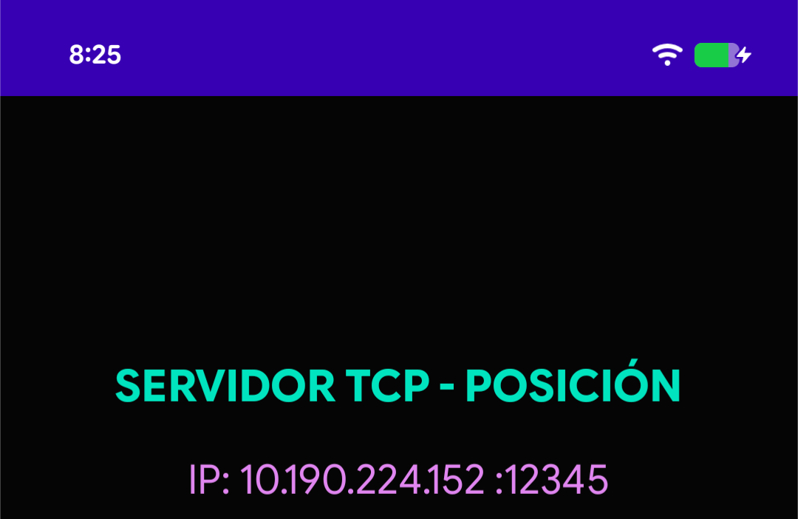
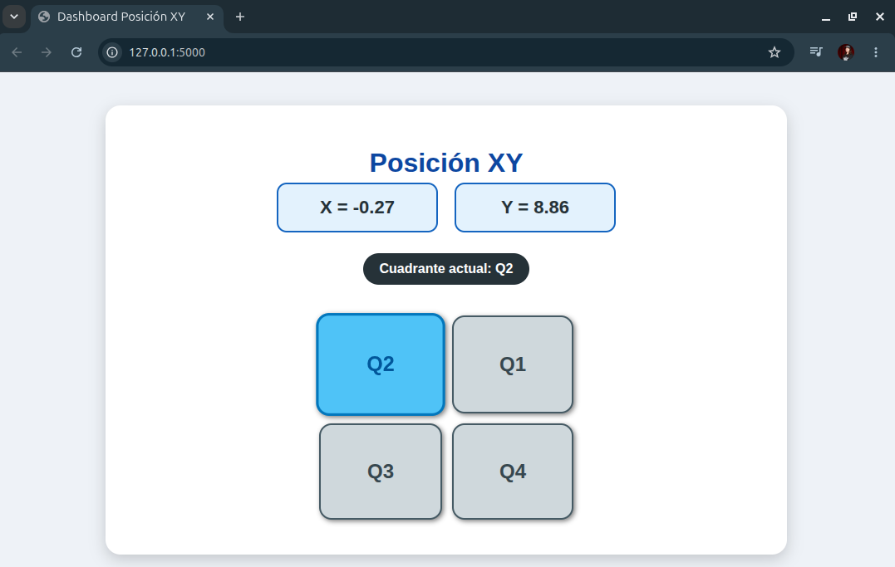
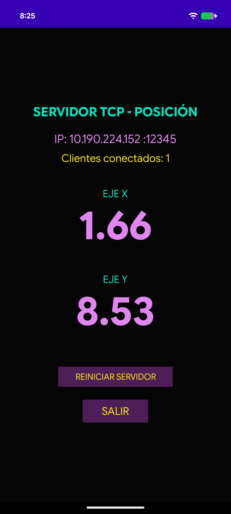

# Actividad Flask + DataXY

Este proyecto corresponde a una actividad práctica para aprender a utilizar **Flask**, **HTML/CSS** y **GitHub**.

La aplicación recibe datos de posición **X** e **Y** desde una aplicación móvil Android mediante una conexión **TCP**. Luego, estos datos son procesados por Flask y mostrados en una página web con una interfaz visual tipo dashboard.

Además, como mejora extra, se agregó una sección de acceso a información de **LineageOS para distintas familias de dispositivos Motorola**, aplicando lo aprendido en la primera parte del proyecto.

---

## Objetivo de la actividad

El objetivo principal es modificar una aplicación base para crear una interfaz gráfica que permita visualizar datos enviados desde un dispositivo móvil.

Durante la actividad se busca que el estudiante pueda:

- Clonar un repositorio desde GitHub.
- Ejecutar un servidor Flask en Python.
- Recibir datos **X** e **Y** desde una aplicación móvil.
- Mostrar los datos recibidos en una página HTML.
- Personalizar la interfaz usando CSS.
- Encender visualmente un cuadrante según la posición de los valores **X** e **Y**.
- Agregar nuevas rutas y páginas HTML dentro del proyecto Flask.
- Crear una sección extra con acceso a familias de dispositivos Motorola relacionadas con LineageOS.
- Subir la versión modificada a un repositorio propio en GitHub.

---

## Requisitos

Antes de ejecutar el proyecto, se debe contar con lo siguiente:

- Python 3 instalado.
- Flask instalado.
- Una cuenta de GitHub.
- Git instalado en el computador.
- Un celular Android conectado a la misma red WiFi que el computador.
- Aplicación móvil **XYaTCPfull.apk** para enviar los datos.

---

## Instalación de Flask

Si Flask no está instalado, se puede instalar con el siguiente comando:

```bash
pip install flask
```

En algunos sistemas puede ser necesario usar:

```bash
python3 -m pip install flask
```

---

## Descarga de la aplicación móvil

Descarga directa del siguiente enlace:

[Descargar XYaTCPfull.apk](https://github.com/Deivid21/l401-lecturas-xy/raw/refs/heads/main/resources/XYaTCPfull.apk)

> **Importante:** el celular y el computador deben estar conectados a la misma red local para que la comunicación funcione correctamente.

---

## Clonar el repositorio base

Para descargar el proyecto inicial, ejecutar:

```bash
git clone https://https://github.com/Deivid21/l401-lecturas-xy.git
cd l401-lecturas-xy
```

---

## Estructura del proyecto

La estructura base del proyecto es la siguiente:

```text
.
├── app.py
├── README.md
├── resources
│   └── XYaTCPfull.apk
├── screenshoots
│   ├── device-view.png
│   ├── ip-device.png
│   └── vista-base.png
└── templates
    ├── device.html
    ├── devices
    │   ├── coming-soon.html
    │   ├── defy.html
    │   ├── edge.html
    │   ├── lenovo-k-series.html
    │   ├── moto-e.html
    │   ├── moto-g.html
    │   ├── moto-p.html
    │   ├── moto-s.html
    │   ├── moto-x.html
    │   ├── moto-z.html
    │   └── one.html
    └── index.html
```

## Descripción de archivos y carpetas principales

| Archivo o carpeta | Descripción |
|---|---|
| `app.py` | Archivo principal del servidor Flask. Recibe los datos X e Y, calcula el cuadrante activo y renderiza las páginas HTML. |
| `README.md` | Documento explicativo del proyecto. |
| `resources/` | Carpeta utilizada para guardar recursos descargables del proyecto. |
| `resources/XYaTCPfull.apk` | Aplicación Android utilizada para enviar los datos X e Y al servidor. |
| `screenshoots/` | Carpeta utilizada para guardar capturas del funcionamiento del proyecto. |
| `templates/index.html` | Página principal del dashboard XY. |
| `templates/device.html` | Página principal de selección de familias de dispositivos Android. |
| `templates/devices/` | Carpeta que contiene una página HTML independiente para cada familia de dispositivos. |

> Nota: la carpeta `screenshoots` mantiene ese nombre porque así está definida dentro del proyecto. Si se cambia a `screenshots`, también se deben actualizar las rutas de las imágenes en el README y en el código.

---

## Configuración del servidor

En el archivo `app.py` se debe revisar la IP y el puerto utilizados para la comunicación:

```python
HOST = "10.190.224.152"
PORT = 12345
```

El valor de `HOST` debe corresponder a la dirección IP del dispositivo, abra la aplicacion de este proyecto para ver su direccion IP.



---

## Ejecutar el proyecto

Para iniciar la aplicación Flask:

```bash
python3 app.py
```

Luego abrir el navegador y entrar a:

```text
http://127.0.0.1:5000
```

---

## Funcionamiento esperado - Parte 1

La aplicación debe recibir los valores **X** e **Y** enviados desde el celular y mostrarlos en una página web.

Además, la interfaz debe indicar en qué cuadrante se encuentra la posición recibida:

| Cuadrante | Condición |
|---|---|
| Q1 | X > 0 y Y > 0 |
| Q2 | X < 0 y Y > 0 |
| Q3 | X < 0 y Y < 0 |
| Q4 | X > 0 y Y < 0 |
| Eje | X = 0 o Y = 0 |

La celda correspondiente debe cambiar de color para mostrar visualmente el cuadrante activo.

---

## Capturas del proyecto - Parte 1

### Vista en el navegador



### Aplicación Android



---

## Extra agregado: acceso a LineageOS para dispositivos Motorola

Como mejora adicional al proyecto base, se agregó una nueva sección dentro de la aplicación Flask para mostrar accesos a distintas familias de dispositivos Motorola relacionados con Android y LineageOS.

Esta sección utiliza lo aprendido en la primera parte del proyecto, aplicando:

- Creación de nuevas rutas en Flask.
- Uso de nuevas páginas HTML.
- Navegación mediante botones.
- Organización de archivos dentro de `templates`.
- Uso de imágenes guardadas dentro del mismo repositorio.
- Personalización visual con CSS.

La página principal de esta sección se encuentra en:

```text
templates/device.html
```

Desde esta página se puede acceder a distintas familias de dispositivos:

- Moto E
- Moto G
- Moto X
- Moto Z
- Moto S
- Motorola Edge
- Motorola Defy
- Motorola One
- Moto P
- Lenovo K Series

Cada botón dirige a una página HTML independiente ubicada dentro de la carpeta:

```text
templates/devices/
```

Por ejemplo:

```text
templates/devices/moto-e.html
templates/devices/moto-g.html
templates/devices/moto-x.html
templates/devices/edge.html
```

La ruta principal para entrar a esta sección es:

```text
http://127.0.0.1:5000/devices
```

---

